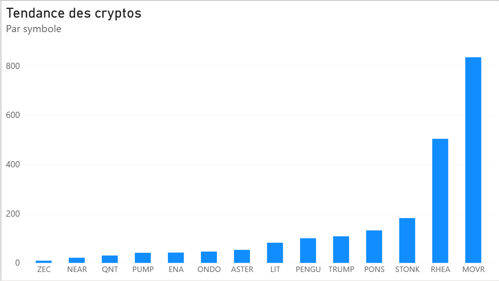

# Pipeline ETL de Cryptomonnaies avec Microsoft Fabric

Ce projet démontre la création d'un pipeline d'ingénierie des données de bout en bout en utilisant l'architecture Médaillon sur Microsoft Fabric. Il extrait, transforme et visualise les données des cryptomonnaies les plus tendances du marché.

## 🎯 Objectif
Automatiser la collecte quotidienne des tendances du marché crypto via une API externe pour alimenter un tableau de bord analytique, le tout sans intervention manuelle.

## 🏗️ Architecture Technique
* **Source :** API REST publique (CoinGecko).
* **Couche Bronze (Ingestion) :** Pipeline de données Fabric pour l'extraction des données brutes.
* **Couche Silver (Transformation) :** Nettoyage, aplatissement des structures JSON complexes et typage des données via **PySpark** (Notebook).
* **Couche Gold (Exposition) :** Modèle sémantique **Direct Lake** connecté au point de terminaison d'analytique SQL pour des performances optimales.
* **Visualisation :** Rapport **Power BI** illustrant le classement mondial et la tendance des actifs.

## ⚙️ Automatisation
Orchestration du pipeline de données configurée pour une exécution quotidienne autonome à 08h00.

## 📊 Tableau de bord Power BI

